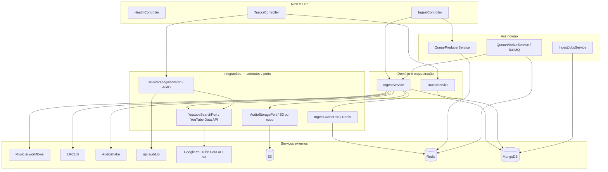

# schubert-api

API backend **NestJS** do produto Cifra.ai: ingestão de áudio MP3, análise de acordes/seções (Music.ai), letras (LRCLIB + transcrição Audioshake), reconhecimento musical (AudD), persistência em **MongoDB** e filas **BullMQ** opcionais para ingestão assíncrona.

---

## Stack

| Camada | Tecnologia |
|--------|------------|
| Framework | NestJS 11, Express |
| Dados | Mongoose / MongoDB |
| Auth | Passport JWT (JWKS Auth0) |
| Filas | BullMQ + Redis (ingest assíncrono) |
| Observabilidade | Sentry (bootstrap dedicado) |

---

## Arquitetura em camadas

### Visão geral



### Princípios

1. **`AppModule`** regista `JwtAuthGuard` como guard global; rotas públicas usam o decorador `@Public()`.
2. **Integrações externas** não são chamadas diretamente pelos controllers de negócio: há **ports** (`abstract class` / interfaces em `src/integrations/...`) e implementações concretas registadas nos módulos Nest (`useClass` / `useExisting`).
3. **`IngestService`** orquestra o pipeline de ingestão (cache por hash do áudio, acordes, letras, upload, YouTube, persistência da `Track`).
4. **`TracksModule`** importa `IngestModule` e `MusicRecognitionModule`, expondo rotas REST sob o prefixo `tracks`.

### Estrutura de pastas (resumo)

| Pasta | Função |
|-------|--------|
| `src/auth/` | JWT Auth0 (`JwtStrategy`, guard, claims de plano/permissões) |
| `src/tracks/` | CRUD leitura pública, identify, PATCH por dono |
| `src/ingest/` | `IngestService`, controller de ingest, providers de cifra/letra |
| `src/ingest-jobs/` | Estado de jobs de ingest assíncrono (MongoDB) |
| `src/queue/` | BullMQ: produtor, worker, constantes |
| `src/integrations/` | Implementações por domínio (YouTube, AudD, storage, cache, Music.ai, …) |
| `src/artists/`, `src/slug/` | Modelos e geração de slugs |
| `src/health/` | Liveness |

---

## Autenticação

- **Predefinição:** todas as rotas exigem `Authorization: Bearer <access_token>` válido (Auth0), exceto as marcadas com `@Public()`.
- Variáveis obrigatórias para arrancar a estratégia JWT: `AUTH0_DOMAIN`, `AUTH0_AUDIENCE`. Opcional: `AUTH0_ISSUER` (override do issuer).

Rotas **públicas** (sem JWT):

- `GET /health`
- `GET /tracks/by-slug/:artistSlug/:songSlug`
- `GET /tracks/by-key/:key`

As restantes rotas documentadas abaixo assumem JWT salvo quando não indicado o contrário.

---

## Referência de rotas HTTP

Base URL de exemplo: `http://localhost:3001` (configurável via `PORT`). Não há prefixo global extra além das paths indicadas.

### Saúde

| Método | Path | Auth | Descrição |
|--------|------|------|-----------|
| `GET` | `/health` | Pública | Verificação simples de disponibilidade do serviço. |

### Faixas — leitura

| Método | Path | Auth | Descrição |
|--------|------|------|-----------|
| `GET` | `/tracks/by-slug/:artistSlug/:songSlug` | Pública | Devolve a faixa canónica + lista de **variações** (mesmo par de slugs). Aceita `req.user` opcional para filtrar variações privadas do visitante. |
| `GET` | `/tracks/by-key/:key` | Pública | Resolve por `trackId` ou `spotifyId`. |

### Reconhecimento musical

| Método | Path | Auth | Descrição |
|--------|------|------|-----------|
| `POST` | `/tracks/identify` | JWT | Multipart: campo `file` (MP3). Envia excerto ao **AudD** (`MusicRecognitionPort`); devolve metadados (`RecognizedSongDto`) e, se existir, uma `Track` já catalogada. Inclui campos de permissão (`canEditTrack`, `canCreateVariation`). |

### Ingestão de cifra (upload MP3)

| Método | Path | Auth | Descrição |
|--------|------|------|-----------|
| `POST` | `/tracks/ingest` | JWT | Multipart: `file` (MP3 obrigatório) e `meta` (JSON string ou objeto). Executa pipeline completo (acordes Music.ai, letras LRCLIB/transcrição, storage opcional, URL YouTube, persistência). |
| `GET` | `/tracks/ingest/jobs/:jobId` | JWT | Consulta estado/progresso de um job de ingest quando `INGEST_ASYNC_ENABLED=1`. |
| `POST` | `/tracks/ingest/spotify` | JWT | **Stub:** responde `202 Accepted` com `{ ok: true }`; não executa ingestão a partir do Spotify (compatibilidade com clientes antigos). |

**Modo síncrono vs assíncrono (`POST /tracks/ingest`):**

- `INGEST_ASYNC_ENABLED≠1` (default): processamento inline; resposta inclui `track` e `status: completed`.
- `INGEST_ASYNC_ENABLED=1` + `REDIS_URL`: enfileira job BullMQ; resposta inicial `{ jobId, status: queued }`; o cliente faz polling em `GET /tracks/ingest/jobs/:jobId`.

### Faixas — atualização (dono)

| Método | Path | Auth | Descrição |
|--------|------|------|-----------|
| `PATCH` | `/tracks/by-slug/:artistSlug/:songSlug` | JWT | Atualização parcial: `chords`, `lyrics`, `lyricsSource`, `sections`, `variationLabel`, `is_private` (apenas dono Auth0). |
| `PATCH` | `/tracks/by-key/:key` | JWT | Idem, chave pública `trackId` ou `spotifyId`. |

---

### Administração de filas (opcional)

Se `REDIS_URL` estiver definido e `BULLBOARD_ENABLED` não for `0`, o servidor monta o **Bull Board** em:

- `GET /admin/queues`

Útil para inspecionar a fila de ingest assíncrono.

---

## Pipeline de ingestão (resumo)

Ordem lógica dos estágios reportados ao cliente (`onStage` / `IngestJobsService`):

1. **`resolveChordsAndSections`** — análise do ficheiro MP3 via Music.ai (com cache Redis por hash SHA-256 do áudio).
2. **`resolveLyrics`** — LRCLIB quando há `title`/`artist` no meta e pesquisa não está desativada; senão transcrição alinhada (Audioshake) via `LyricsTranscriptionStrategyFactory`.
3. **`uploadAudio`** — envio opcional para storage (`AUDIO_STORAGE_PROVIDER`).
4. **`resolveYoutube`** — URL explícita no meta, cache, ou pesquisa YouTube Data API (`YOUTUBE_DATA_API_KEY`).
5. **`persistTrack`** — gravação/atualização em MongoDB (`Track`, `Artist`, slugs).

Meta multipart: aceita campos alinhados com `RecognizedSongDto` (Spotify IDs, YouTube, capa, etc.) — ver `src/ingest/ingest-meta.parser.ts`.

---

## Configuração

Copie `.env.example` para `.env` e preencha os segredos. Variáveis frequentes:

| Variável | Função |
|----------|--------|
| `PORT` | Porta HTTP (default `3001`) |
| `MONGODB_URI` | Ligação MongoDB |
| `WEB_APP_ORIGIN` | Origens CORS (lista separada por vírgulas) |
| `AUTH0_DOMAIN`, `AUTH0_AUDIENCE` | Validação JWT |
| `AUDD_API_TOKEN` | Reconhecimento AudD |
| `MUSIC_AI_API_KEY`, workflows Music.ai | Acordes/seções |
| `YOUTUBE_DATA_API_KEY` | Enriquecimento `youtubeUrl` |
| `REDIS_URL`, `INGEST_ASYNC_ENABLED` | Fila + cache de ingest |
| `AUDIO_STORAGE_*` | Áudio persistido (S3 ou noop) |
| `SENTRY_*` | Erros e tracing |

Variáveis adicionais (LRCLIB, Audioshake, Music.ai fine-tuning) estão referenciadas nos providers em `src/ingest/providers/` e `src/integrations/`.

---

## Execução local

```bash
npm install
cp .env.example .env   # editar valores
npm run start:dev
```

Build de produção:

```bash
npm run build
npm run start:prod
```

---

## Relação com o monorepo

Este pacote é tipicamente consumido pelo frontend **`cifra.ai-web`**. Outros serviços no repositório (por exemplo **`beethoven-api`**) são projetos separados; este README cobre apenas **schubert-api**.
